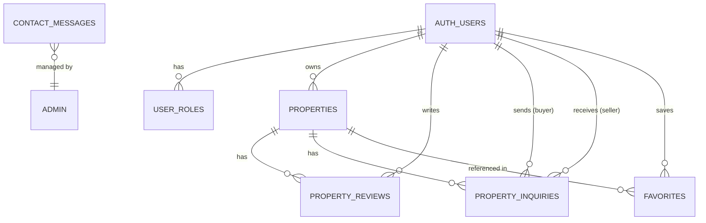

# Smart Property Finder — Database Schema

> **Platform:** Supabase (PostgreSQL)
> **Auth:** Supabase Auth (`auth.users`)
> **RLS:** Enabled on all tables

---

## 1. Entity Relationship Overview

---

## 2. Tables

### 2.1 `auth.users` (Supabase Managed)

Managed entirely by Supabase Auth. Key fields used by the app:

| Column           | Type   | Notes                                    |
| ---------------- | ------ | ---------------------------------------- |
| `id`             | UUID   | Primary key                              |
| `email`          | TEXT   | User email                               |
| `user_metadata`  | JSONB  | Contains `{ role, full_name, ... }`      |
| `created_at`     | TIMESTAMPTZ | Registration timestamp              |

---

### 2.2 `user_roles`

Stores the authoritative role for each user. Supports real-time role changes.

| Column      | Type         | Constraints                                          |
| ----------- | ------------ | ---------------------------------------------------- |
| `id`        | UUID         | PK, `DEFAULT gen_random_uuid()`                      |
| `user_id`   | UUID         | FK → `auth.users(id)`, NOT NULL                      |
| `role`      | TEXT         | `CHECK (role IN ('buyer', 'seller', 'admin', 'blocked'))` |
| `created_at`| TIMESTAMPTZ  | `DEFAULT now()`                                      |

**RLS Policies:**
- Authenticated users can read their own role.
- Admins can read and update all roles.

---

### 2.3 `properties`

Core listings table.

| Column           | Type         | Constraints / Notes                              |
| ---------------- | ------------ | ------------------------------------------------ |
| `id`             | UUID         | PK, `DEFAULT gen_random_uuid()`                  |
| `user_id`        | UUID         | FK → `auth.users(id)`, owner of the property     |
| `title`          | TEXT         | NOT NULL                                         |
| `description`    | TEXT         |                                                  |
| `price`          | NUMERIC      |                                                  |
| `location`       | TEXT         |                                                  |
| `type`           | TEXT         | e.g., `'House'`, `'Apartment'`, `'Land'`         |
| `beds`           | INTEGER      |                                                  |
| `baths`          | INTEGER      |                                                  |
| `sqft`           | INTEGER      |                                                  |
| `parking`        | TEXT         |                                                  |
| `amenities`      | TEXT[]       | PostgreSQL array of amenity strings               |
| `images`         | TEXT[]       | Array of image URLs (Supabase Storage or external) |
| `is_featured`    | BOOLEAN      | `DEFAULT false`                                  |
| `is_sponsored`   | BOOLEAN      | `DEFAULT false`                                  |
| `is_available`   | BOOLEAN      | `DEFAULT true` (added via migration)             |
| `max_guests`     | INTEGER      | (added via migration)                            |
| `contact_number` | TEXT         |                                                  |
| `map_url`        | TEXT         | Google Maps embed URL (added via migration)      |
| `created_at`     | TIMESTAMPTZ  | `DEFAULT now()`                                  |

**RLS Policies:**
- Public can view all available properties.
- Authenticated sellers can insert/update/delete their own properties.
- Admins can manage all properties.

---

### 2.4 `property_reviews`

User-submitted reviews for properties.

| Column        | Type         | Constraints                                        |
| ------------- | ------------ | -------------------------------------------------- |
| `id`          | UUID         | PK, `DEFAULT gen_random_uuid()`                    |
| `property_id` | UUID        | FK → `properties(id)` ON DELETE CASCADE, NOT NULL  |
| `user_id`     | UUID         | FK → `auth.users(id)` ON DELETE CASCADE, NOT NULL  |
| `rating`      | INTEGER      | `CHECK (rating >= 1 AND rating <= 5)`, NOT NULL    |
| `comment`     | TEXT         |                                                    |
| `created_at`  | TIMESTAMPTZ  | `DEFAULT now()`                                    |

**RLS Policies:**
- Public can view all reviews.
- Authenticated users can create reviews (own `user_id` only).

---

### 2.5 `property_inquiries`

Buyer-to-seller messaging for property inquiries.

| Column        | Type         | Constraints                                        |
| ------------- | ------------ | -------------------------------------------------- |
| `id`          | UUID         | PK, `DEFAULT gen_random_uuid()`                    |
| `property_id` | UUID        | FK → `properties(id)` ON DELETE CASCADE, NOT NULL  |
| `seller_id`   | UUID         | FK → `auth.users(id)` ON DELETE CASCADE, NOT NULL  |
| `buyer_id`    | UUID         | FK → `auth.users(id)` ON DELETE CASCADE, NOT NULL  |
| `message`     | TEXT         | NOT NULL                                           |
| `reply`       | TEXT         | Seller's response (nullable)                       |
| `status`      | TEXT         | `DEFAULT 'pending'`, `CHECK (IN ('pending', 'replied'))` |
| `created_at`  | TIMESTAMPTZ  | `DEFAULT now()`                                    |

**RLS Policies:**
- Buyers can insert inquiries (own `buyer_id` only).
- Buyers can view their own inquiries.
- Sellers can view inquiries targeting their properties.
- Sellers can update inquiries (to reply).

---

### 2.6 `contact_messages`

Public contact form submissions.

| Column      | Type         | Constraints                                              |
| ----------- | ------------ | -------------------------------------------------------- |
| `id`        | UUID         | PK, `DEFAULT gen_random_uuid()`                          |
| `name`      | TEXT         | NOT NULL                                                 |
| `email`     | TEXT         | NOT NULL                                                 |
| `subject`   | TEXT         | NOT NULL                                                 |
| `message`   | TEXT         | NOT NULL                                                 |
| `status`    | TEXT         | `DEFAULT 'unread'`, `CHECK (IN ('unread', 'read', 'replied', 'archived'))` |
| `created_at`| TIMESTAMPTZ  | `DEFAULT now()`                                          |

**RLS Policies:**
- Anyone (anon + authenticated) can insert messages.
- Only admins can view, update, and delete messages (uses `has_role()` function).

---

### 2.7 `favorites` (Inferred)

Stores user-favourited properties.

| Column        | Type         | Constraints                                       |
| ------------- | ------------ | ------------------------------------------------- |
| `id`          | UUID         | PK                                                |
| `user_id`     | UUID         | FK → `auth.users(id)`                             |
| `property_id` | UUID         | FK → `properties(id)` ON DELETE CASCADE           |
| `created_at`  | TIMESTAMPTZ  | `DEFAULT now()`                                   |

**RLS Policies:**
- Authenticated users can manage their own favourites.

---

## 3. Database Functions

### `has_role(user_id UUID, role_name TEXT) → BOOLEAN`

A helper function used in RLS policies to check if a user has a specific role. Referenced in `contact_messages` policies for admin-only access.

---

## 4. Realtime Subscriptions

The app subscribes to real-time changes on `user_roles` filtered by the current user's ID. This enables:
- **Instant role promotion/demotion** — UI redirects automatically.
- **Account blocking** — Triggers immediate forced sign-out with alert.

Channel pattern: `user-roles-{user_id}`

---

## 5. SQL Migration Files

| File                              | Purpose                                          |
| --------------------------------- | ------------------------------------------------ |
| `contact_messages_schema.sql`     | Creates `contact_messages` table + RLS policies  |
| `property_inquiries_schema.sql`   | Creates `property_inquiries` table + RLS policies|
| `reviews_schema.sql`              | Creates `property_reviews` table + RLS policies  |
| `property_updates_schema.sql`     | Adds `is_available`, `max_guests` to properties  |
| `google_map_schema.sql`           | Adds `map_url` column to properties              |

> **Note:** The `properties`, `user_roles`, and `favorites` table schemas are not present as standalone SQL files — these were likely created directly in the Supabase dashboard.
