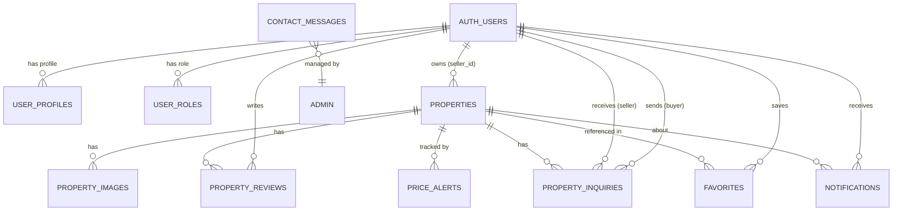

# Smart Property Finder — Database Schema

> **Platform:** Supabase (PostgreSQL)
> **Auth:** Supabase Auth (`auth.users`)
> **Storage:** Supabase Storage (bucket: `property-images`)
> **RLS:** Enabled on all tables

---

## 1. Entity Relationship Overview

```mermaid
erDiagram
    AUTH_USERS ||--o{ USER_PROFILES : "has profile"
    AUTH_USERS ||--o{ USER_ROLES : "has role"
    AUTH_USERS ||--o{ PROPERTIES : "owns (seller_id)"
    AUTH_USERS ||--o{ PROPERTY_REVIEWS : "writes"
    AUTH_USERS ||--o{ PROPERTY_INQUIRIES : "sends (buyer)"
    AUTH_USERS ||--o{ PROPERTY_INQUIRIES : "receives (seller)"
    AUTH_USERS ||--o{ FAVORITES : "saves"
    AUTH_USERS ||--o{ NOTIFICATIONS : "receives"
    PROPERTIES ||--o{ PROPERTY_IMAGES : "has"
    PROPERTIES ||--o{ PROPERTY_REVIEWS : "has"
    PROPERTIES ||--o{ PROPERTY_INQUIRIES : "has"
    PROPERTIES ||--o{ FAVORITES : "referenced in"
    PROPERTIES ||--o{ PRICE_ALERTS : "tracked by"
    PROPERTIES ||--o{ NOTIFICATIONS : "about"
    CONTACT_MESSAGES }o--|| ADMIN : "managed by"
```

---

## 2. Tables

### 2.1 `auth.users` (Supabase Managed)

Managed entirely by Supabase Auth. Key fields used by the app:

| Column           | Type   | Notes                                    |
| ---------------- | ------ | ---------------------------------------- |
| `id`             | UUID   | Primary key                              |
| `email`          | TEXT   | User email                               |
| `user_metadata`  | JSONB  | Contains `{ role, full_name, ... }`      |
| `created_at`     | TIMESTAMPTZ | Registration timestamp              |

---

### 2.2 `user_profiles`

Stores extended user profile information. Referenced by admin dashboards, property details, inquiries, and reviews.

| Column      | Type         | Constraints / Notes                                  |
| ----------- | ------------ | ---------------------------------------------------- |
| `user_id`   | UUID         | FK → `auth.users(id)`, unique                        |
| `full_name` | TEXT         | User display name                                    |
| `phone`     | TEXT         | Contact phone number                                 |
| *other*     | —            | Additional profile fields as needed                  |

**Used in:**
- `UserManagement.jsx` — admin user listing
- `PropertyDetails.jsx` — seller info & reviewer names
- `Profile.jsx` — user profile view/edit
- `Inquiries.jsx` — buyer name lookup
- `AdminStats.jsx` — user count
- `AnalyticsReports.jsx` — user growth metrics

---

### 2.3 `user_roles`

Stores the authoritative role for each user. Supports real-time role changes.

| Column      | Type         | Constraints                                          |
| ----------- | ------------ | ---------------------------------------------------- |
| `id`        | UUID         | PK, `DEFAULT gen_random_uuid()`                      |
| `user_id`   | UUID         | FK → `auth.users(id)`, NOT NULL                      |
| `role`      | TEXT         | `CHECK (role IN ('buyer', 'seller', 'admin', 'blocked'))` |
| `created_at`| TIMESTAMPTZ  | `DEFAULT now()`                                      |

**RLS Policies:**
- Authenticated users can read their own role.
- Admins can read and update all roles.

---

### 2.4 `properties`

Core listings table. Column names differ from the original schema — the app uses `seller_id`, `property_type`, `city`, `address`, `bedrooms`, `bathrooms`, `area_sqft`, etc.

| Column           | Type         | Constraints / Notes                              |
| ---------------- | ------------ | ------------------------------------------------ |
| `id`             | UUID         | PK, `DEFAULT gen_random_uuid()`                  |
| `seller_id`      | UUID         | FK → `auth.users(id)`, owner of the property     |
| `title`          | TEXT         | NOT NULL                                         |
| `description`    | TEXT         |                                                  |
| `price`          | NUMERIC      |                                                  |
| `property_type`  | TEXT         | e.g., `'house'`, `'apartment'`, `'villa'`, `'land'`, `'boarding'` |
| `city`           | TEXT         | City / locality                                  |
| `address`        | TEXT         | Full address                                     |
| `state`          | TEXT         | State / Province                                 |
| `zip_code`       | TEXT         | Postal code                                      |
| `bedrooms`       | INTEGER      |                                                  |
| `bathrooms`      | INTEGER      |                                                  |
| `area_sqft`      | NUMERIC      | Property area in square feet                     |
| `area_sqm`       | NUMERIC      | Property area in square metres (alternative)     |
| `max_guests`     | INTEGER      | Maximum guest capacity                           |
| `contact_number` | TEXT         | Owner contact number                             |
| `map_url`        | TEXT         | Google Maps embed URL                            |
| `is_available`   | BOOLEAN      | `DEFAULT true`                                   |
| `is_featured`    | BOOLEAN      | `DEFAULT false`                                  |
| `is_sponsored`   | BOOLEAN      | `DEFAULT false`                                  |
| `status`         | TEXT         | e.g., `'active'` — listing status                |
| `views`          | INTEGER      | View counter (incremented via RPC)               |
| `created_at`     | TIMESTAMPTZ  | `DEFAULT now()`                                  |

**RLS Policies:**
- Public can view all available properties.
- Authenticated sellers can insert/update/delete their own properties (`seller_id` = `auth.uid()`).
- Admins can manage all properties.

---

### 2.5 `property_images`

Stores image URLs for properties. Images are uploaded to Supabase Storage bucket `property-images` and referenced here.

| Column        | Type         | Constraints                                       |
| ------------- | ------------ | ------------------------------------------------- |
| `id`          | UUID         | PK, `DEFAULT gen_random_uuid()`                   |
| `property_id` | UUID        | FK → `properties(id)` ON DELETE CASCADE            |
| `image_url`   | TEXT         | Public URL from Supabase Storage                  |
| `is_primary`  | BOOLEAN      | `DEFAULT false` — first uploaded image is primary  |

**Used in:**
- `AddProperty.jsx` — inserts image records after upload
- `EditProperty.jsx` — manages existing images, adds new ones
- `PropertyDetails.jsx`, `Properties.jsx`, `Home.jsx`, `Favorites.jsx` — fetches via `property_images(image_url, is_primary)` join
- `PropertyManagement.jsx` (admin) — deletes images from storage and DB

---

### 2.6 `property_reviews`

User-submitted reviews for properties.

| Column        | Type         | Constraints                                        |
| ------------- | ------------ | -------------------------------------------------- |
| `id`          | UUID         | PK, `DEFAULT gen_random_uuid()`                    |
| `property_id` | UUID        | FK → `properties(id)` ON DELETE CASCADE, NOT NULL  |
| `user_id`     | UUID         | FK → `auth.users(id)` ON DELETE CASCADE, NOT NULL  |
| `rating`      | INTEGER      | `CHECK (rating >= 1 AND rating <= 5)`, NOT NULL    |
| `comment`     | TEXT         |                                                    |
| `created_at`  | TIMESTAMPTZ  | `DEFAULT now()`                                    |

**RLS Policies:**
- Public can view all reviews.
- Authenticated users can create reviews (own `user_id` only).

---

### 2.7 `property_inquiries`

Buyer-to-seller messaging for property inquiries.

| Column        | Type         | Constraints                                        |
| ------------- | ------------ | -------------------------------------------------- |
| `id`          | UUID         | PK, `DEFAULT gen_random_uuid()`                    |
| `property_id` | UUID        | FK → `properties(id)` ON DELETE CASCADE, NOT NULL  |
| `seller_id`   | UUID         | FK → `auth.users(id)` ON DELETE CASCADE, NOT NULL  |
| `buyer_id`    | UUID         | FK → `auth.users(id)` ON DELETE CASCADE, NOT NULL  |
| `message`     | TEXT         | NOT NULL                                           |
| `reply`       | TEXT         | Seller's response (nullable)                       |
| `status`      | TEXT         | `DEFAULT 'pending'`, `CHECK (IN ('pending', 'replied'))` |
| `created_at`  | TIMESTAMPTZ  | `DEFAULT now()`                                    |

**RLS Policies:**
- Buyers can insert inquiries (own `buyer_id` only).
- Buyers can view their own inquiries.
- Sellers can view inquiries targeting their properties.
- Sellers can update inquiries (to reply).

---

### 2.8 `contact_messages`

Public contact form submissions.

| Column      | Type         | Constraints                                              |
| ----------- | ------------ | -------------------------------------------------------- |
| `id`        | UUID         | PK, `DEFAULT gen_random_uuid()`                          |
| `name`      | TEXT         | NOT NULL                                                 |
| `email`     | TEXT         | NOT NULL                                                 |
| `subject`   | TEXT         | NOT NULL                                                 |
| `message`   | TEXT         | NOT NULL                                                 |
| `status`    | TEXT         | `DEFAULT 'unread'`, `CHECK (IN ('unread', 'read', 'replied', 'archived'))` |
| `created_at`| TIMESTAMPTZ  | `DEFAULT now()`                                          |

**RLS Policies:**
- Anyone (anon + authenticated) can insert messages.
- Only admins can view, update, and delete messages (uses `has_role()` function).

---

### 2.9 `favorites`

Stores user-favourited properties.

| Column        | Type         | Constraints                                       |
| ------------- | ------------ | ------------------------------------------------- |
| `id`          | UUID         | PK                                                |
| `user_id`     | UUID         | FK → `auth.users(id)`                             |
| `property_id` | UUID         | FK → `properties(id)` ON DELETE CASCADE           |
| `created_at`  | TIMESTAMPTZ  | `DEFAULT now()`                                   |

**RLS Policies:**
- Authenticated users can manage their own favourites.

---

### 2.10 `price_alerts`

Stores WhatsApp phone number subscriptions for price drop notifications.

| Column        | Type         | Constraints                                       |
| ------------- | ------------ | ------------------------------------------------- |
| `id`          | UUID         | PK, `DEFAULT uuid_generate_v4()`                  |
| `property_id` | UUID        | FK → `properties(id)` ON DELETE CASCADE            |
| `phone_number`| VARCHAR(20)  | NOT NULL — WhatsApp number in E.164 format        |
| `created_at`  | TIMESTAMPTZ  | `DEFAULT NOW()`                                   |

**RLS Policies:**
- Anyone can insert price alerts.
- Anyone can view price alerts.

> **Note:** The backend server (`server.js`) also maintains a local `price_alerts.json` file as a fallback if the Supabase insert fails.

---

### 2.11 `notifications`

In-app notification records for users.

| Column        | Type         | Constraints                                       |
| ------------- | ------------ | ------------------------------------------------- |
| `id`          | UUID         | PK, `DEFAULT uuid_generate_v4()`                  |
| `user_id`     | UUID         | FK → `auth.users(id)` ON DELETE CASCADE            |
| `property_id` | UUID        | FK → `properties(id)` ON DELETE CASCADE            |
| `title`       | VARCHAR(255) | NOT NULL                                          |
| `message`     | TEXT         | NOT NULL                                          |
| `is_read`     | BOOLEAN      | `DEFAULT false`                                   |
| `created_at`  | TIMESTAMPTZ  | `DEFAULT NOW()`                                   |

**RLS Policies:**
- Users can view their own notifications.
- Users can update their own notifications (mark as read).
- Anyone can insert notifications.

---

## 3. Database Functions

### `has_role(user_id UUID, role_name TEXT) → BOOLEAN`

A helper function used in RLS policies to check if a user has a specific role. Referenced in `contact_messages` policies for admin-only access.

### `increment_property_views(property_id_param UUID)`

An RPC function that atomically increments the `views` counter on a property. Called from `PropertyDetails.jsx` when a user visits a property page (with session-based deduplication to prevent spam).

---

## 4. Supabase Storage

### Bucket: `property-images`

- **Purpose:** Stores uploaded property listing images.
- **Access:** Public read access (images served via public URLs).
- **Upload path pattern:** `properties/{propertyId}-{randomString}.{ext}`
- **Used by:**
  - `AddProperty.jsx` — uploads images on property creation
  - `EditProperty.jsx` — uploads new images, deletes old ones
  - `PropertyManagement.jsx` (admin) — deletes images when removing properties

---

## 5. Realtime Subscriptions

The app subscribes to real-time changes on `user_roles` filtered by the current user's ID. This enables:
- **Instant role promotion/demotion** — UI redirects automatically.
- **Account blocking** — Triggers immediate forced sign-out with alert.

Channel pattern: `user-roles-{user_id}`

---

## 6. SQL Migration Files

| File                              | Purpose                                          |
| --------------------------------- | ------------------------------------------------ |
| `contact_messages_schema.sql`     | Creates `contact_messages` table + RLS policies  |
| `property_inquiries_schema.sql`   | Creates `property_inquiries` table + RLS policies|
| `reviews_schema.sql`              | Creates `property_reviews` table + RLS policies  |
| `property_updates_schema.sql`     | Adds `is_available`, `max_guests` to properties  |
| `google_map_schema.sql`           | Adds `map_url` column to properties              |
| `notifications_schema.sql`        | Creates `notifications` table + RLS policies     |
| `price_alerts_schema.sql`         | Creates `price_alerts` table + RLS policies      |

> **Note:** The `properties`, `property_images`, `user_profiles`, `user_roles`, and `favorites` table schemas are not present as standalone SQL files — these were likely created directly in the Supabase dashboard.
